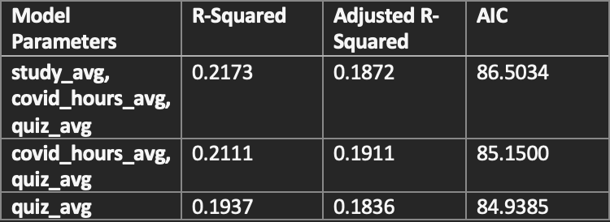
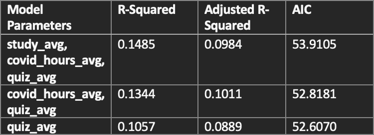

```{r setup, include=FALSE}
knitr::opts_chunk$set(echo = FALSE)
```


```{r, message = FALSE}
# Setting up the project
# Make sure these libraries are installed before running code

# install.packages("tidyverse")
# install.packages("gtsummary")
# install.packages("GGally")
# install.packages("gridExtra")
# install.packages("ggfortify")
# install.packages("olsrr")

# Load these libraries in the project
library(tidyverse)
library(gtsummary)
library(GGally)
library(ggfortify)
library(olsrr)
library(gridExtra)

```


```{r, message= FALSE}
# Load the Data
covid_data <- read_csv("data.csv")
```


```{r, message=FALSE}
# Data Cleaning
# Making everything numeric
covid_data$X1<- as.numeric(as.character(covid_data$X1))
covid_data$`STA302 hours (W1)` <- as.numeric(as.character(covid_data$`STA302 hours (W1)`))
covid_data$`COVID hours (W1)` <- as.numeric(as.character(covid_data$`COVID hours (W1)`))
covid_data$Quiz_1_score <- as.numeric(as.character(covid_data$Quiz_1_score))
covid_data$`STA302 hours (W2)` <- as.numeric(as.character(covid_data$`STA302 hours (W2)`))
covid_data$`COVID hours (W2)` <- as.numeric(as.character(covid_data$`COVID hours (W2)`))
covid_data$Quiz_2_score <- as.numeric(as.character(covid_data$Quiz_2_score))
covid_data$`STA302 hours (W3)` <- as.numeric(as.character(covid_data$`STA302 hours (W3)`))
covid_data$`COVID hours (W3)` <- as.numeric(as.character(covid_data$`COVID hours (W3)`))
covid_data$Quiz_3_score <- as.numeric(as.character(covid_data$Quiz_3_score))
covid_data$`STA302 hours (W4)` <- as.numeric(as.character(covid_data$`STA302 hours (W4)`))
covid_data$`COVID hours (W4)` <- as.numeric(as.character(covid_data$`COVID hours (W4)`))
covid_data$Quiz_4_score <- as.numeric(as.character(covid_data$Quiz_4_score))

# Uniform alphabet case of countries 
covid_data <- covid_data %>%
  mutate(Country = tolower(covid_data$Country))

# Aggregating countries according to region
covid_data <- covid_data %>%
  mutate(region = case_when(
    Country %in% c("canada", "usa") ~ "north america",
    Country %in% c("china", "taiwan", "south korea", "singapore", "japan", "mongolia", "india", "pakistan", "uae") ~ "asia"))


# Removing Rows that contain NA
covid_data <- na.omit(covid_data)
```


# SECTION 1: INTRODUCTION

  In this report, I am analyzing data collected by STA302 students throughout the semester. In this data set, there have several predictor variables including the grades students received on each quiz, the country they currently reside in, the number of hours they spend studying for this course on a weekly basis and the number of hours students think about COVID-19 weekly. The goal of this project is discover how the predictor variables in my model can affect a student's performance in Quiz 4. In the context of this project, the grade a student receives in Quiz 4 is the dependent variable. The possible predictor variables we have are the independent variables. Furthermore, I aim to develop a model for each region which can be used by individuals to predict their performance on Quiz 4.

  As a first step, I will clean the data. This includes removing any rows that had a n/a value in it. Then, I will split the data according to regions. The regions were North America and Asia. There will be two different sets of models based on these regions. As preliminary analysis, I will plot the data using pair plots and do comparisons. By doing this I will be able to tell the distributions of our independent variables. I will also normalize any data that is not following a normal distribution. Once I am sure all the data points are adequate I will build the multi-linear regression model. The main goal of this study is to see which of the predictor variables can actually predict the values of a student's performance in Quiz 4. To achieve this, I will use backward stepwise regression. Furthermore, my models will be verified by checking all of the violations of assumptions so that I can make sure I do not have variables that are not needed.


# SECTION 2: EXPLORATORY DATA ANALYSIS


## SECTION 2.1: Variables of Interest 

```{r, message=FALSE}
#Creating new average columns


# New Quiz Average Variable
covid_data <- covid_data %>%
  mutate(quiz_avg = (Quiz_1_score + Quiz_2_score + Quiz_3_score)/3)

# New Average number of hours a person considered COVID-19 Variable
covid_data <- covid_data %>%
  mutate(covid_hours_avg = (`COVID hours (W1)` + `COVID hours (W2)`+ `COVID hours (W3)` + `COVID hours (W4)`)/4)

# New Average number of hours a person studied for 302
covid_data <- covid_data %>%
  mutate(study_avg = (`STA302 hours (W1)` + `STA302 hours (W2)` + `STA302 hours (W3)` + `STA302 hours (W4)`)/4)
```

```{r, message=FALSE}
# Creating a new dataset which only includes X1, region, quiz_average, covid_hours_avg, study_avg, and Quiz_4_score variables

clean_covid_data <- covid_data %>%
  select(X1, region, quiz_avg, covid_hours_avg, study_avg, Quiz_4_score)
```
  
  The dataset we are working with in this project has been renamed to "covid_data" for convenience. The cohort of this dataset were STA302 students enrolled in the 2021 summer semester. There are 227 observations and 14 variables in this data set. From these variables, 11 of them could be used as potential predictors to predict the grade a student receives on quiz 4. But, I would not be using these predictors as is. Instead, I would be aggregating similar variables into mean-averages. I will find the mean study time before quiz 4 for each student and place it in a new "study_avg" variable. Similarly, I will find the mean time a student thought about covid and place it in a new "covid_hours_avg" variable. Finally, I would also find the mean of the first three quizzes for each student and place it in a new "quiz_avg" variable. This was done because these variables would be a more accurate representation of the initial predictors. These new predictors would also make my model less complex as there are less predictors. I also created new dataframe named "clean_covid_data". This only included the variables I was interested in. These were X1(id), region, quiz_average, covid_hours_avg, study_avg, and Quiz_4_score. 
  
## SECTION 2.2: Seperating Data by Region 

```{r, message=FALSE}
# Making three small datasets according to region

# South Asian Dataset
asia_covid <- clean_covid_data %>%
  subset(region == "asia")

# North America Dataset
north_america_covid <- clean_covid_data %>%
  subset(region == "north america")
```

  I split the new dataset (clean_covid_data) into two new dataframes according to the region the student was located in during this semester. The two regions that I included were North America and Asia. I separated the data by region because different regions have different COVID-19 situations. With this information, I intend to develop two different models for the two different regions. I will be using the "asia_covid" and "north_america_covid" dataframes to do so.  

  
## SECTION 2.3: Summary Statistics for Variables of Interest

  In this section, I intend to display important summary statistics for the variables of interest for both regions. 

### Quiz Average


#### North America

```{r, message=FALSE}
# Histogram for North America's Quiz Average
north_america_quiz_hist <- ggplot(north_america_covid, aes(x = north_america_covid$quiz_avg)) + geom_histogram(bins = 15, col = "black", fill = "blue") + geom_vline(xintercept = mean(north_america_covid$quiz_avg), color = "red") + 
  labs(title = "North America Quiz Average", x = "Quiz Average") + theme(plot.title = element_text(hjust = 0.5))

# Boxplot for North America's Quiz Average
north_america_quiz_boxplot <- ggplot(north_america_covid, aes(x=north_america_covid$quiz_avg)) + 
  geom_boxplot(col = "black", fill = "light blue") + geom_vline(xintercept = mean(north_america_covid$quiz_avg), color = "red") + 
  labs(title = "North America Quiz Average", x = "Quiz Average") + theme(plot.title = element_text(hjust = 0.5)
                                                                         )
grid.arrange(north_america_quiz_hist, north_america_quiz_boxplot, nrow = 1)
```
*These visualizations for North America's Quiz average tell us the following:*

* The mean is **`r mean(north_america_covid$quiz_avg)`**.
* The median is **`r median(north_america_covid$quiz_avg)`**.
* The minimum is **`r min(north_america_covid$quiz_avg)`**.
* The maximum is **`r max(north_america_covid$quiz_avg)`**.
* The first quartile is **`r quantile(north_america_covid$quiz_avg)[2]`**.
* The third quartile is **`r quantile(north_america_covid$quiz_avg)[4]`**.
* The interquartile range is **`r IQR(north_america_covid$quiz_avg)`**.


#### Asia

```{r, message=FALSE}
# Histogram for Asia's Quiz Average
asia_quiz_hist <- ggplot(asia_covid, aes(x = asia_covid$quiz_avg)) + geom_histogram(bins = 15, col = "black", fill = "blue") + geom_vline(xintercept = mean(asia_covid$quiz_avg), color = "red") + 
  labs(title = "Asia Quiz Average", x = "Quiz Average") + theme(plot.title = element_text(hjust = 0.5))

# Boxplot for Asia's Quiz Average
asia_quiz_boxplot <- ggplot(asia_covid, aes(x=asia_covid$quiz_avg)) + 
  geom_boxplot(col = "black", fill = "light blue") + geom_vline(xintercept = mean(asia_covid$quiz_avg), color = "red") + 
  labs(title = "Asia Quiz Average", x = "Quiz Average") + theme(plot.title = element_text(hjust = 0.5))

grid.arrange(asia_quiz_hist, asia_quiz_boxplot, nrow = 1)
```
*These visualizations for Asia's Quiz average tell us the following:*

* The mean is **`r mean(asia_covid$quiz_avg)`**.
* The median is **`r median(asia_covid$quiz_avg)`**.
* The minimum is **`r min(asia_covid$quiz_avg)`**.
* The maximum is **`r max(asia_covid$quiz_avg)`**.
* The first quartile is **`r quantile(asia_covid$quiz_avg)[2]`**.
* The third quartile is **`r quantile(asia_covid$quiz_avg)[4]`**.
* The interquartile range is **`r IQR(asia_covid$quiz_avg)`**.


### Covid Hours Average


#### North America

```{r, message=FALSE}
# Histogram for North America's COVID Hours Average
north_america_covid_hours_hist <- ggplot(north_america_covid, aes(x = north_america_covid$covid_hours_avg)) + geom_histogram(bins = 15, col = "black", fill = "blue") + geom_vline(xintercept = mean(north_america_covid$covid_hours_avg), color = "red") + 
  labs(title = "COVID Consideration Average", x = "COVID hours Average") + theme(plot.title = element_text(hjust = 0.5))


# Boxplot for North America's COVID Hours Average
north_america_covid_hours_boxplot <- ggplot(north_america_covid, aes(x=north_america_covid$covid_hours_avg)) + 
  geom_boxplot(col = "black", fill = "light blue") + geom_vline(xintercept = mean(north_america_covid$covid_hours_avg), color = "red") + 
  labs(title = "COVID Consideration Average", x = "COVID hours Average") + theme(plot.title = element_text(hjust = 0.5))

grid.arrange(north_america_covid_hours_hist, north_america_covid_hours_boxplot, nrow = 1)
```
*These visualizations for North America's time considering COVID average tell us the following:*

* The mean is **`r mean(north_america_covid$covid_hours_avg)`**.
* The median is **`r median(north_america_covid$covid_hours_avg)`**.
* The minimum is **`r min(north_america_covid$covid_hours_avg)`**.
* The maximum is **`r max(north_america_covid$covid_hours_avg)`**.
* The first quartile is **`r quantile(north_america_covid$covid_hours_avg)[2]`**.
* The third quartile is **`r quantile(north_america_covid$covid_hours_avg)[4]`**.
* The interquartile range is **`r IQR(north_america_covid$covid_hours_avg)`**.


#### Asia

```{r, message=FALSE}
# Histogram for Asia's COVID Hours Average
asia_covid_hours_hist <- ggplot(asia_covid, aes(x = asia_covid$covid_hours_avg)) + geom_histogram(bins = 15, col = "black", fill = "blue") + geom_vline(xintercept = mean(asia_covid$covid_hours_avg), color = "red") + 
  labs(title = "Asia Time Considering COVID Average", x = "COVID Hours Average") + theme(plot.title = element_text(hjust = 0.5))


# Boxplot for Asia's COVID Hours Average
asia_covid_hours_boxplot <- ggplot(asia_covid, aes(x=asia_covid$covid_hours_avg)) + 
  geom_boxplot(col = "black", fill = "light blue") + geom_vline(xintercept = mean(asia_covid$covid_hours_avg), color = "red") + 
  labs(title = "Asia Time Considering COVID Average", x = "COVID Hours Average") + theme(plot.title = element_text(hjust = 0.5))

grid.arrange(asia_covid_hours_hist, asia_covid_hours_boxplot, nrow = 1)
```
*These visualizations for Asia's time considering COVID average tell us the following:*

* The mean is **`r mean(asia_covid$covid_hours_avg)`**.
* The median is **`r median(asia_covid$covid_hours_avg)`**.
* The minimum is **`r min(asia_covid$covid_hours_avg)`**.
* The maximum is **`r max(asia_covid$covid_hours_avg)`**.
* The first quartile is **`r quantile(asia_covid$covid_hours_avg)[2]`**.
* The third quartile is **`r quantile(asia_covid$covid_hours_avg)[4]`**.
* The interquartile range is **`r IQR(asia_covid$covid_hours_avg)`**.


### Study Hours Average


#### North America

```{r, message=FALSE}
# Histogram for North America's Study Hours Average
north_america_covid_hours_hist <- ggplot(north_america_covid, aes(x = north_america_covid$study_avg)) + geom_histogram(bins = 15, col = "black", fill = "blue") + geom_vline(xintercept = mean(north_america_covid$study_avg), color = "red") + 
  labs(title = "Time Considering COVID Average", x = "COVID hours Average") + theme(plot.title = element_text(hjust = 0.5))

# Boxplot for North America's Study Hours Average
north_america_covid_hours_boxplot <- ggplot(north_america_covid, aes(x=north_america_covid$study_avg)) + 
  geom_boxplot(col = "black", fill = "light blue") + geom_vline(xintercept = mean(north_america_covid$study_avg), color = "red") + 
  labs(title = "Time Considering COVID Average", x = "COVID hours Average") + theme(plot.title = element_text(hjust = 0.5))

grid.arrange(north_america_covid_hours_hist, north_america_covid_hours_boxplot, nrow = 1)
```
*These visualizations for North America's study hours average tell us the following:*

* The mean is **`r mean(north_america_covid$study_avg)`**.
* The median is **`r median(north_america_covid$study_avg)`**.
* The minimum is **`r min(north_america_covid$study_avg)`**.
* The maximum is **`r max(north_america_covid$study_avg)`**.
* The first quartile is **`r quantile(north_america_covid$study_avg)[2]`**.
* The third quartile is **`r quantile(north_america_covid$study_avg)[4]`**.
* The interquartile range is **`r IQR(north_america_covid$study_avg)`**.


#### Asia

```{r, message=FALSE}
# Histogram for Asia's Study Hours Average
asia_covid_hours_hist <- ggplot(asia_covid, aes(x = asia_covid$study_avg)) + geom_histogram(bins = 15, col = "black", fill = "blue") + geom_vline(xintercept = mean(asia_covid$study_avg), color = "red") + 
  labs(title = "Asia COVID Consideration Average", x = "COVID Hours Average") + theme(plot.title = element_text(hjust = 0.5))


# Boxplot for Asia's Study Hours Average
asia_covid_hours_boxplot <- ggplot(asia_covid, aes(x=asia_covid$study_avg)) + 
  geom_boxplot(col = "black", fill = "light blue") + geom_vline(xintercept = mean(asia_covid$study_avg), color = "red") + 
  labs(title = "Asia COVID Consideration Average", x = "COVID Hours Average") + theme(plot.title = element_text(hjust = 0.5))

grid.arrange(asia_covid_hours_hist, asia_covid_hours_boxplot, nrow = 1)
```
*These visualizations for Asia's study hours average tell us the following:*

* The mean is **`r mean(asia_covid$study_avg)`**.
* The median is **`r median(asia_covid$study_avg)`**.
* The minimum is **`r min(asia_covid$study_avg)`**.
* The maximum is **`r max(asia_covid$study_avg)`**.
* The first quartile is **`r quantile(asia_covid$study_avg)[2]`**.
* The third quartile is **`r quantile(asia_covid$study_avg)[4]`**.
* The interquartile range is **`r IQR(asia_covid$study_avg)`**.


## SECTION 2.4: Transformation of Data

```{r, message=FALSE}
# Creating a function to center around mean
center_scale <- function(var) {
    scale(var, scale = FALSE)
}

# Centering North America's study_avg around the mean
north_america_covid$study_avg <- center_scale(north_america_covid$study_avg)

# Centering North America's quiz_avg around the mean
north_america_covid$quiz_avg <- center_scale(north_america_covid$quiz_avg)

# Centering North America's covid_hours_avg around the mean
north_america_covid$covid_hours_avg <- center_scale(north_america_covid$covid_hours_avg)

# Centering Asia's study_avg around the mean
asia_covid$study_avg <- center_scale(asia_covid$study_avg)

# Centering Asia's quiz_avg around the mean
asia_covid$quiz_avg <- center_scale(asia_covid$quiz_avg)

# Centering Asia's covid_hours_avg around the mean
asia_covid$covid_hours_avg <- center_scale(asia_covid$covid_hours_avg)
```

I decided to center each of the variables of interest around its respective mean. This did two things. First, there was a new interpretation of the intercept. The new intercept is the mean of the response when all of the predictors have a value of 0. Secondly, the slope between the predictors and the response did not change. It still has the same value as it had before the mean-center transformation was applied. 


## SECTION 2.5: Correlation

### North America

```{r}
# north_america_pp <- ggpairs(north_america_covid, columns = 3:6, title = "Pair Plot for North America") + theme(plot.title = element_text(hjust = 0.5))
# north_america_pp
# For some reason ggpairs stopped working. I got the correlation values stated below from ggpairs. I included a base R pairs plot for your convenience. 

north_america_pp_data <- north_america_covid %>%
  select(quiz_avg, covid_hours_avg, study_avg, Quiz_4_score)

north_america_pp <- pairs(north_america_pp_data)

north_america_pp
```

  From the pair-plot of the North American data, we can see that no two predictors are highly correlated with each other. This is a good as there is no multicollinearity among our predictors. Furthermore, we can see there is significant correlation between "Quiz_4_score" and "quiz_avg". This tells us that "Quiz_4_score" and "quiz_avg" are significantly related. 


### Asia

```{r, message=FALSE}
# asia_pp <- ggpairs(asia_covid, columns = 3:6, title = "Pair Plot for Asia") + theme(plot.title = element_text(hjust = 0.5))
# asia_pp
asia_pp_data <- asia_covid %>%
  select(quiz_avg, covid_hours_avg, study_avg, Quiz_4_score)

asia_pp <- pairs(asia_pp_data)

asia_pp
```
  From the pair-plot of the Asian data, we can see that no two predictors are significantly correlated with each other. This tells is that there is no multicollinearity among the predictors. I also noted there is significant correlation between "Quiz_4_score" and "quiz_avg". This tells us that "Quiz_4_score" and "quiz_avg" are significantly related. 
  

## SECTION 2.6: Finding Influential Points

In this section I aim to find influential points in the datasets. I will continue to analyze the Asian dataset and the North American dataset separately. The influential points would be removed if necessary. I am doing this to increase the stability of my model as influential points affect the model output the most. Influential points are not the same as outliers. I removed influential points because they have higher leverage than outliers. I will be using Cook's distance to identify influential points. Points that have a Cook’s Distance greater than 3 times the mean of Cook’s distances are considered influential.

### North America

As a starting point, I will make a linear model including all of our predictors. This will be called "base_north_america_model". I aim to remove any data points that align with Cook’s Distance greater than 3 times the mean of Cook's distances criteria. Upon inspection, only 1 data point fit this criteria. It was removed from the dataset. From now on, we will be working with a new dataframe called "north_america_covid_clean". This dataframe does not include that point. I realized that is an influential point (X1 = 137) and should be removed as the input for COVID Hours (W1) was 160 hours which is certainly misleading data.

```{r}
# Making base North America Model
base_north_america_model <- lm(Quiz_4_score ~ study_avg + covid_hours_avg + quiz_avg, data = north_america_covid)

# Finding Cook's Distance
cd_north_america <- round(cooks.distance(base_north_america_model), 5)
north_america_mean_cd <- mean(cd_north_america)

# Removing Influential points using the 3*mean(cooks distance) criteria
influential <- as.numeric(names(cd_north_america)[(cd_north_america > 3*(north_america_mean_cd))])
north_america_covid_clean <- north_america_covid[-influential,]

```


### Asia

As a starting point, I will make a linear model including all of our predictors. This will be called "base_asia_model". I will remove any data point that has a Cook’s Distance greater than 3 times the mean value of Cook's distances. Upon inspection, there were 3 data points that met this criteria. These were removed. This can possibly be accredited to a mistake in data entry or the point just being an outlier. Taking a closer look, I realized that the average time spent considering COVID for one of these points was abnormally high. I realized that it was high because one of the student's input for COVID Hours (W4) was 60 hours which is misleading data. The data point X= 86 was removed because the student's average study time was 3.25 hours and this can't be true as every student spent at least 6 hours studying which watching the course lectures.

```{r}
# Making base Asia Model
base_asia_model <- lm(Quiz_4_score ~ study_avg + covid_hours_avg + quiz_avg, data = asia_covid)

# Finding Cook's Distance
cd_asia <- round(cooks.distance(base_asia_model), 5)
asia_mean_cd <- mean(cd_asia)

# Removing Influential points using the 3*mean(cooks distance) criteria
influential <- as.numeric(names(cd_asia)[(cd_asia > 3*(asia_mean_cd))])
asia_covid_clean <- asia_covid[-influential,]
```


# SECTION 3: MODEL DEVELOPMENT

```{r, message=FALSE}
# North America Data
# First model includes all three predictors

model1 <- lm(Quiz_4_score ~ quiz_avg + covid_hours_avg + study_avg, data = north_america_covid_clean)

SSres_model1 <- sum(model1$residuals^2)
Rsq_model1 <- summary(model1)$r.squared
Rsq_adj_model1 <- summary(model1)$adj.r.squared
p_prime_model1 <- length(model1$coefficients)
n_model1 <- nrow(north_america_covid_clean)
AIC_model1 <- n_model1*log(SSres_model1) - n_model1*log(n_model1) + 2*p_prime_model1

# Second model 
model2 <- lm(Quiz_4_score ~ quiz_avg + covid_hours_avg, data = north_america_covid_clean)

SSres_model2 <- sum(model2$residuals^2)
Rsq_model2 <- summary(model2)$r.squared
Rsq_adj_model2 <- summary(model2)$adj.r.squared
p_prime_model2 <- length(model2$coefficients)
n_model2 <- nrow(north_america_covid_clean)
AIC_model2 <- n_model2*log(SSres_model2) - n_model2*log(n_model2) + 2*p_prime_model2

# Third model
model3 <- lm(Quiz_4_score ~ quiz_avg, data = north_america_covid_clean)

SSres_model3 <- sum(model3$residuals^2)
Rsq_model3 <- summary(model3)$r.squared
Rsq_adj_model3 <- summary(model3)$adj.r.squared
p_prime_model3 <- length(model3$coefficients)
n_model3 <- nrow(north_america_covid_clean)
AIC_model3 <- n_model3*log(SSres_model3) - n_model3*log(n_model3) + 2*p_prime_model3
```

```{r, message=FALSE}
# Asia Data
# First model includes all three predictors

model1_a <- lm(Quiz_4_score ~ quiz_avg + covid_hours_avg + study_avg, data = asia_covid_clean)

SSres_model1_a <- sum(model1_a$residuals^2)
Rsq_model1_a <- summary(model1_a)$r.squared
Rsq_adj_model1_a <- summary(model1_a)$adj.r.squared
p_prime_model1_a <- length(model1_a$coefficients)
n_model1_a <- nrow(asia_covid_clean)
AIC_model1_a <- n_model1_a*log(SSres_model1_a) - n_model1_a*log(n_model1_a) + 2*p_prime_model1_a

# Second model 
model2_a <- lm(Quiz_4_score ~ quiz_avg + covid_hours_avg, data = asia_covid_clean)

SSres_model2_a <- sum(model2_a$residuals^2)
Rsq_model2_a <- summary(model2_a)$r.squared
Rsq_adj_model2_a <- summary(model2_a)$adj.r.squared
p_prime_model2_a <- length(model2_a$coefficients)
n_model2_a <- nrow(asia_covid_clean)
AIC_model2_a <- n_model2_a*log(SSres_model2_a) - n_model2_a*log(n_model2_a) + 2*p_prime_model2_a

# Third model
model3_a <- lm(Quiz_4_score ~ quiz_avg, data = asia_covid_clean)

SSres_model3_a <- sum(model3_a$residuals^2)
Rsq_model3_a <- summary(model3_a)$r.squared
Rsq_adj_model3_a <- summary(model3_a)$adj.r.squared
p_prime_model3_a <- length(model3_a$coefficients)
n_model3_a <- nrow(asia_covid_clean)
AIC_model3_a <- n_model3_a*log(SSres_model3_a) - n_model3_a*log(n_model3_a) + 2*p_prime_model3_a
```


## SECTION 3.1: Backward Stepwise Regression

  In my analysis, I used backward stepwise regression to come up with the final model. I started with a model that had all three predictor variables. These three predictor variables were the average time a student spent studying during weeks 1-4, the average time a student spent thinking about COVID, and the average of the first three quizzes. To check the goodness of the fit of the model, I used Akaike information criterion (AIC). I used backward stepwise regression separately on both the North American dataset and the Asian dataset. I chose to use backward stepwise regression because I wanted to see which variables were significant. The easiest way to do this was to check the significance level in the summary table for the each model.

### North America 

Using backward stepwise regression, three models were made for the cleaned North America dataset. The first model included all three predictors namely quiz_avg, covid_hours_avg, study_avg. Upon calling the summary of this model, I realized that covid_hours_avg and study_avg were not significant variables. The adjusted R-squared value for this model was 0.1872. The AIC value for this model was 86.5034. Since covid_hours_avg and study_avg were not significant, I decided to remove study_hours from the model. Now, the second model only included covid_hours_avg and quiz_avg as predictors. The adjusted R-Squared value for this multivariate model was 0.1911. This was higher than the previous model so this meant that I was moving in the right direction. The AIC value also decreased to 85.1500. This meant that the goodness of fit of the model was improving. Finally, I decided to remove covid_hours_avg as a predictor variable as well. I did this because in the summary statistics for the model, this variable was insignificant. The final model only included quiz_avg as a predictor variable. This model had a R-Squared (not adjusted R-Squared as this is a bivariate model) value of 0.1937. The AIC value for this model was 84.9385. The R-Squared value increased with this model and the AIC value decreased. Both of these were good signs and I knew I had the best possible model for the North America Data. The table below summarizes my findings for all three models. The code for model development can be found in the Appendix.




The final model for North America was:
$$Quiz 4 Grade = 6.977 + 0.547*studyaverage + \epsilon$$


Below is a summary table for the chosen North America linear regression model.

```{r, message=FALSE}
multi.fit_na = glm(Quiz_4_score ~ quiz_avg, data = north_america_covid_clean)

t1_na <- tbl_regression(multi.fit_na, exponentiate = FALSE)
t1_na
```


### Asia

Similar to the North American models, backward stepwise regression was used to develop three models for the cleaned Asia dataset. The first model included all three predictors namely quiz_avg, covid_hours_avg, study_avg. Upon calling the summary of this model, I realized that covid_hours_avg and study_avg were not significant variables. The adjusted R-squared value for this model was 0.0984. The AIC value for this model was 53.9105. Since covid_hours_avg and study_avg were not significant, I decided to remove study_hours from the model. Now, the second model only included covid_hours_avg and quiz_avg as the independent variables. The adjusted R-Squared value for this multivariate model was 0.1011. This was higher than the previous model so this meant that I was moving in the right direction. The AIC value also decreased to 52.8181. This meant that the goodness of fit of the model was improving. Finally, I decided to remove covid_hours_avg as an independent variable as well. This was done because in the summary statistics for the model, this variable was insignificant. The final model only included quiz_avg as an independent variable. This model had a R-Squared (not adjusted R-Squared as this is a bivariate model) value of 0.1057. The AIC value for this model was 52.6070. The R-Squared value increased with this model and the AIC value decreased. Both of these were good signs and I knew I had the best possible model for the Asia Data. The table below summarizes my findings for all three models. The code for model development can be found in the Appendix. 



The final model for Asia was :
$$Quiz 4 Grade = 8.019 + 0.323*studyaverage + \epsilon$$


Below is a summary table for the chosen Asia linear regression model.

```{r, message=FALSE}
multi.fit = glm(Quiz_4_score ~ quiz_avg, data = asia_covid_clean)

t1 <- tbl_regression(multi.fit, exponentiate = FALSE)
t1
```


## SECTION 3.2: Intepretation of Final Model

### North America

The slope intercept for the final North America model was 6.977. Our data was mean centered. So, this means when the average hours studied is zero, a student is expected to receive a grade of 6.977 on Quiz 4. The slope estimate term for avg_study was 0.547. This means when avg_study goes up by 1 hour, the grade a student receives on Quiz 4 goes up by 0.547.


### Asia

The slope intercept for the final Asia model was 8.019. Our data was mean centered. So, this means when the average hours studied is zero, a student is expected to receive a grade of 8.019 on Quiz 4. The slope estimate term for avg_study was 0.323 This means when avg_study goes up by 1 hour, the grade a student receives on Quiz 4 goes up by 0.323.


## SECTION 3.3: Assumptions of Linear Regression

### North America
```{r}
autoplot(model3)
```


### Asia
```{r}
autoplot(model3_a)
```


# SECTION 4: CONCLUSION


  The goal of this project was to determine the impact predictor variables had on the response variable. The predictor variables were quiz averages, the average amount of studying a student did prior to quiz 4, and the average time a student spent thinking about COVID 19. The response variable was the grade a student received on quiz four. I aimed to identify a relation or determine the impact of these three variables on quiz 4 grades, varying by region.

  I created various models for the two separate regions(Asia and North America). In the first region of North America, three models were created using a total of three variables. The reliability of these three variables was determined from tests run on the models. In all of the models the p value for quiz_average was always the lowest meaning that this predictor was important in my models. Secondly, the p value for study_avg was low, but not low enough that we can say with full confidence that it had a major impact on the grades of quiz four. The covid_hours_avg predictor was shown to be insignificant in many different models due to the p value being very large. The results were similar in the Asian modelling as well. 
  
  Based on my analysis, I was able to conclude that the only predictor necessary to predict a student's performance on Quiz 4 was the average of the previous three quizzes. This was quite surprising as I was expecting COVID to have an influence in at least one of the regions but that was not the case. However, the two regions had different models. The slope intercept for each was different as was the coefficient for average_quiz. 


# APPENDIX

## Code for Model Development
```{r, Echo=TRUE, results='hide'}
# North America Data
# First model includes all three predictors

model1 <- lm(Quiz_4_score ~ quiz_avg + covid_hours_avg + study_avg, data = north_america_covid_clean)

SSres_model1 <- sum(model1$residuals^2)
Rsq_model1 <- summary(model1)$r.squared
Rsq_adj_model1 <- summary(model1)$adj.r.squared
p_prime_model1 <- length(model1$coefficients)
n_model1 <- nrow(north_america_covid_clean)
AIC_model1 <- n_model1*log(SSres_model1) - n_model1*log(n_model1) + 2*p_prime_model1

# Second model 
model2 <- lm(Quiz_4_score ~ quiz_avg + covid_hours_avg, data = north_america_covid_clean)

SSres_model2 <- sum(model2$residuals^2)
Rsq_model2 <- summary(model2)$r.squared
Rsq_adj_model2 <- summary(model2)$adj.r.squared
p_prime_model2 <- length(model2$coefficients)
n_model2 <- nrow(north_america_covid_clean)
AIC_model2 <- n_model2*log(SSres_model2) - n_model2*log(n_model2) + 2*p_prime_model2

# Third model
model3 <- lm(Quiz_4_score ~ quiz_avg, data = north_america_covid_clean)

SSres_model3 <- sum(model3$residuals^2)
Rsq_model3 <- summary(model3)$r.squared
Rsq_adj_model3 <- summary(model3)$adj.r.squared
p_prime_model3 <- length(model3$coefficients)
n_model3 <- nrow(north_america_covid_clean)
AIC_model3 <- n_model3*log(SSres_model3) - n_model3*log(n_model3) + 2*p_prime_model3
```

```{r, Echo=TRUE, results='hide'}
# Asia Data
# First model includes all three predictors

model1_a <- lm(Quiz_4_score ~ quiz_avg + covid_hours_avg + study_avg, data = asia_covid_clean)

SSres_model1_a <- sum(model1_a$residuals^2)
Rsq_model1_a <- summary(model1_a)$r.squared
Rsq_adj_model1_a <- summary(model1_a)$adj.r.squared
p_prime_model1_a <- length(model1_a$coefficients)
n_model1_a <- nrow(asia_covid_clean)
AIC_model1_a <- n_model1_a*log(SSres_model1_a) - n_model1_a*log(n_model1_a) + 2*p_prime_model1_a

# Second model 
model2_a <- lm(Quiz_4_score ~ quiz_avg + covid_hours_avg, data = asia_covid_clean)

SSres_model2_a <- sum(model2_a$residuals^2)
Rsq_model2_a <- summary(model2_a)$r.squared
Rsq_adj_model2_a <- summary(model2_a)$adj.r.squared
p_prime_model2_a <- length(model2_a$coefficients)
n_model2_a <- nrow(asia_covid_clean)
AIC_model2_a <- n_model2_a*log(SSres_model2_a) - n_model2_a*log(n_model2_a) + 2*p_prime_model2_a

# Third model
model3_a <- lm(Quiz_4_score ~ quiz_avg, data = asia_covid_clean)

SSres_model3_a <- sum(model3_a$residuals^2)
Rsq_model3_a <- summary(model3_a)$r.squared
Rsq_adj_model3_a <- summary(model3_a)$adj.r.squared
p_prime_model3_a <- length(model3_a$coefficients)
n_model3_a <- nrow(asia_covid_clean)
AIC_model3_a <- n_model3_a*log(SSres_model3_a) - n_model3_a*log(n_model3_a) + 2*p_prime_model3_a
```


